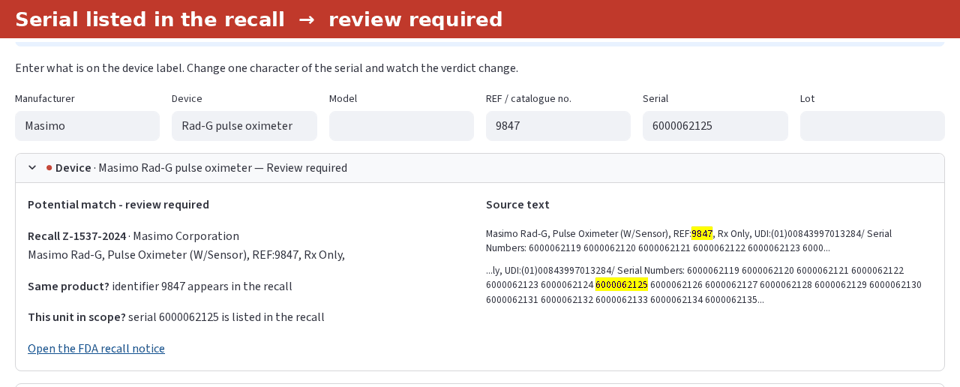
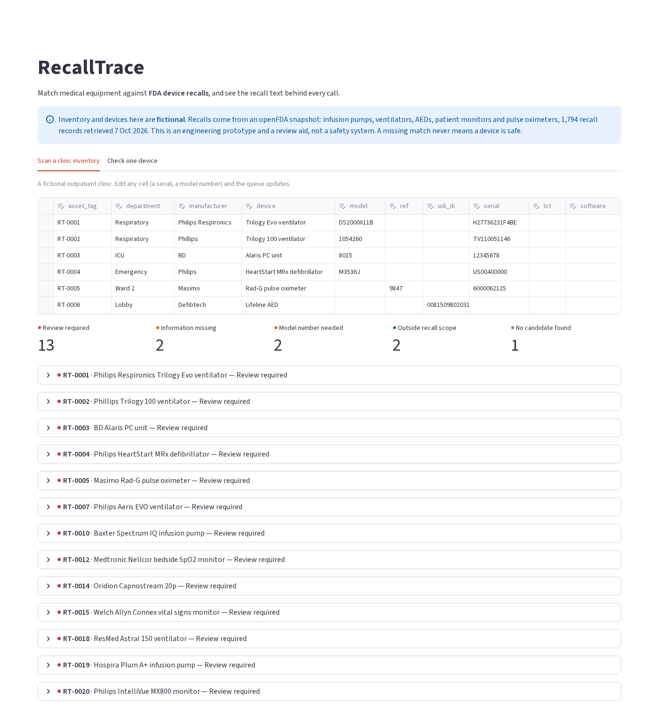

# RecallTrace

[](https://github.com/hxlvvm/RecallTrace/actions/workflows/tests.yml)

**Match a hospital's medical equipment against FDA device recalls, and see the recall text behind every call.**



Live demo: **coming soon** · Fictional inventory, real openFDA recall records

## The problem

When a device is recalled, a clinical engineering team has to answer two questions for every asset it owns:
**is this the recalled product**, and **is this particular unit affected**? The second one is hard, because
recall notices describe the affected units in free text, in every format imaginable:

| What the recall says | What it means for a unit |
|---|---|
| `Serial Numbers: US00453441 through US00453910` | a numeric range |
| `list 11971 - serial numbers 0013120799 through 0099072300; list 11973 - ...` | a different range for each model |
| `Serial Numbers of affected AEDs begin with C16J, C16K, C17A, or C17B` | a prefix rule |
| `All units except those with software version 1.05.06.00` | a software exclusion |
| `only serial number date codes prior to 2237*` | a date encoded inside the serial |
| 350,000 characters of comma-separated serial numbers | an explicit list |

RecallTrace turns that text into a checkable structure and gives each asset one of five outcomes:

- 🔴 **Review required.** The product matches, and the unit is in the stated scope.
- 🟢 **Outside recall scope.** The product matches, but this serial, lot or software version is not covered.
- 🟠 **Information missing.** The recall is limited by lot or serial, and the inventory does not record it.
- 🟠 **Model number needed.** The name looks like a recalled product, but nothing identifies it exactly.
- ⚪ **No candidate found.** This never means "safe". It means nothing in this snapshot matched.



## How it works

```
openFDA recall records ──► gpt-oss-20b (offline, once) ──► proposed structure ──► grounding check ──► scope
                                                                                  (every value must
inventory row ──► exact model / REF / UDI-DI lookup ──► candidate recalls          appear in the
               └► manufacturer + device-name similarity ┘        │                  recall text)
                                                                 ▼
                                               three-valued check: affected / outside / unresolved
```

1. **Extraction.** An open-weight model (gpt-oss-20b, Apache-2.0, served locally with vLLM on one GPU)
   reads the scope text of each recall once. It proposes identifiers, serial and lot lists, ranges,
   prefixes, software conditions and per-model sub-scopes as JSON
   ([`llm_extract.py`](src/recalltrace/llm_extract.py)). Extracting all 1,794 records took about 18 GPU-minutes.
2. **Grounding.** Python drops every value that does not literally occur in the recall text. Long serial
   lists are read by code, not copied by the model. If the model's reply is unusable, the record falls back
   to a regex parser ([`rules.py`](src/recalltrace/rules.py)).
3. **Matching.** Exact model, catalogue and UDI-DI lookups come first. Then BM25 and fuzzy similarity on
   manufacturer and device name, with brand and parent-company aliases suggested by the same model
   (CareFusion → BD, Bio-Detek → ZOLL) ([`match.py`](src/recalltrace/match.py)).
4. **Scope check.** A small deterministic function decides affected, outside scope or unresolved, and says
   why ([`scope.py`](src/recalltrace/scope.py)). A missing serial stays unresolved and is never guessed.

The demo app makes **no LLM calls**. Extractions are cached in the repository, so it runs offline on a
free CPU host.

## Evaluation

All numbers come from hand-written test cases on recall events held out from development. Each
case is one device unit plus the answer a clinical engineer would give. The pass/fail thresholds
were committed before any test ran ([`GATE.md`](GATE.md)). Full results are in [`GATE_RESULT.md`](GATE_RESULT.md).

**Scope check, blind set.** 70 cases on 30 recalls, written after both parsers were frozen:

| | correct | wrong definitive answers | of which "not affected" for an affected unit | answered where it should have abstained | abstained on a definite case |
|---|---|---|---|---|---|
| regex parser | 61 / 70 | 5 | 2 | 3 | 1 |
| LLM + grounding | **64 / 70** | **2** | **1** | **1** | 3 |

The LLM-assisted parser wins on exactly the cases that need structure: per-model ranges, date codes, prefixes
combined with software versions, and lot lists interleaved with UDIs. Its single unsafe answer on the blind set
was a software wildcard (`6.XX`) matched literally. That was fixed afterwards and is not counted as a pass.

**Identity, synthetic inventory rows.** One row per held-out recall per noise type. Inventory names use
real-world aliases from a hand-written table the matcher never sees:

| inventory row | top-3 recall |
|---|---|
| clean (manufacturer, name, model) | 0.94 |
| brand or parent-company alias | 0.91 (0.95 with the logistic reranker) |
| typo | 0.91 |
| no model number | 0.70 |
| two-word name, no model number | 0.50 |

Rows without a model number are genuinely ambiguous across repeat recalls of one product family. The app
reports them as "model number needed" instead of guessing. A logistic-regression reranker gained only
2.6 points over the hand-weighted baseline, short of the 10 points set in advance, so the baseline ships.

## What it cannot do

- **Five device categories only:** infusion pumps, facility ventilators, AEDs, patient monitors and pulse
  oximeters (FDA product codes FRN, CBK, MKJ, MHX, DQA).
- **A snapshot, not a feed.** Recalls after 7 October 2026 are missing.
- **Some date rules are missed.** One recall states its scope as a manufacture date encoded in the serial
  number, and the extractor marked it "all units". That is the safe direction, but still wrong.
- **Not validated against real hospital data.** The test cases are synthetic, written by one person.
  This is a prototype for exploring the problem, not a medical device or a substitute for reading the notice.

## Prior work

Commercial recall-management services exist (for example ECRI's alerts tracker) but are closed and paid.
On GitHub (searched 7 Oct 2026):
- "device recall inventory matching": 0 repositories;
- "openFDA device recall": 24 repositories, which are API wrappers, query servers and recall statistics;
- I found no open tool that checks individual units against recall scope text.

## Run it

```bash
pip install -r requirements.txt
streamlit run app.py                     # the demo
python -m pytest -q tests                # 16 tests
python scripts/eval_scope.py llm --blind # blind scope evaluation
```

Rebuilding from scratch:
1. Run `scripts/fetch_snapshot.py`, `build_snapshot.py` and `split_events.py`.
2. Serve the model, e.g. `vllm serve openai/gpt-oss-20b`; any OpenAI-compatible endpoint works.
3. Run `scripts/run_extraction.py <url> <model> data/extractions/llm.jsonl`, and the same script with
   `--task aliases`.
4. Run `scripts/build_index.py`.

## Data and licence

- Recall records: [openFDA](https://open.fda.gov/apis/device/recall/), CC0, retrieved 7 Oct 2026
  (see `data/snapshot/MANIFEST.json`).
- Inventory, test cases and extractions: fictional or derived, CC0.
- Code: MIT.

Not affiliated with or endorsed by the FDA.
